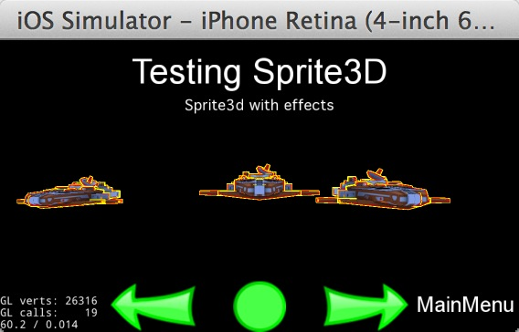

##Sprite3D 
`Sprite3D` is similar to `Sprite` only 3D. You can init a `Sprite3D` by using the built-in `create` functions.

Example:

```cpp
// test case: cpp-tests->Sprite3DTest->Testing Sprite3D
// source: cocos2d-x/tests/cpp-tests/Classes/Sprite3DTest/Sprite3DTest.cpp
// function: Sprite3DBasicTest::addNewSpriteWithCoords(Vec2 p)

//create a Sprite3D by the 'boss1.obj' and set its scale and texture
auto sprite = Sprite3D::create("Sprite3DTest/boss1.obj");
sprite->setScale(3.f);
sprite->setTexture("Sprite3DTest/boss.png"); 
```

As a subclass of `Node`, Sprite3D can be transformed manually or using [Actions](http://www.cocos2d-x.org/wiki/Actions), just like `Sprite`.


##Sprite3D supported format

The `Sprite3D` now supports 3 kinds of formats below

- obj : `obj` is a format exported by 3ds Max or Maya. `Sprite3D` can be created by `obj` format resources immediately. But `obj` format can't support the Animation 

- c3t (Cocos 3d text) : `c3t` is a `Json` format converted from `FBX` format by the `fbv-conv` tool. `c3t` format can be easily read which means it is able to check your data of the model through a `c3t` format file under developing. But `c3t` is a fat file so we don't recommend to use this in your final package of your game. For that, we have the `c3b`.

- c3b (Cocos 3d binary) : `c3b` is a binary file.  It can also be converted through `fbx-conv` with the same `FBX` file when you convert `c3t`. It cant be read but it is smaller and faster than the `c3t`. Most of the time, we choose `c3t` to develop or debug, then use `c3b` into the game. 

### fbv-conv usage

To use `c3t` or `c3b` format, we need `fbx-conv` tool. It can convert `FBX` format to more runtime friendly formats. In Cocos2d-x v3.2, you can find the tool from the path: *`cocos2d-x-3.2rc0/tools/fbx-conv`*

* Mac OS X

```
$ cd COCOS2DX_ROOT/tools/fbx-conv/mac
$ ./fbx-conv [-a|-b|-t] FBXFile
```

* Windows

```
cd COCOS2DX_ROOT/tools/fbx-conv/windows
fbx-conv [-a|-b|-t] FBXFile
```

Options:

* -a: export both text and binary format
* -b: export binary format
* -t: export text format


##Animation 3D

To run an animation of `Sprite3D`, we have `Animation3D\Animate3D` classes. `Animation3D` can be created from the 'c3b' or 'c3t' format files. And then create the `Animate3D` through the Animation3D object. You can use `runAction()` to run the `Animate3D` since it is a subclass of the `ActionInterval`. This is like the relation between `Animation\Animate`. We have a sample in the `testcpp` named `Testing Animate3D`.


```cpp  
// test case: cpp-tests->Sprite3DTest
// source: cocos2d-x/tests/cpp-tests/Classes/Sprite3DTest/Sprite3DTest.cpp
// function:  Sprite3DWithSkinTest::addNewSpriteWithCoords(Vec2 p)
    
std::string fileName = "Sprite3DTest/orc.c3b";      
auto sprite = Sprite3D::create(fileName);
sprite->setScale(3);
sprite->setRotation3D(Vec3(0,180,0));
addChild(sprite);
sprite->setPosition( Vec2( p.x, p.y) );
    
//Create animation3D by the same file of its Spirte3D
auto animation = Animation3D::create(fileName);
if (animation)
    {
    //create the Animate3D
    auto animate = Animate3D::create(animation);
    if(std::rand() %3 == 0)
        {
            animate->setPlayBack(true);        
            int rand2 = std::rand();
            if(rand2 % 3 == 1)
                {
                    animate->setSpeed(animate->getSpeed() + CCRANDOM_0_1());
                }
            else if(rand2 % 3 == 2)
            {
                animate->setSpeed(animate->getSpeed() - 0.5 * CCRANDOM_0_1());
            }
        
       //Run Animate
       sprite->runAction(RepeatForever::create(animate));        
}
```


##Sprite3D Effects

Effects for `Sprite3D`, are not yet supported as of v3.2. This is because it would change a great deal of core code of the engine. But there is a sample implements the `3D outline effect` in [EarthWarrior3D](https://github.com/chukong/EarthWarrior3D) by `Sprite3D` to navigate how to create your own effects. Developers can find the code from `testCpp`.

```cpp
// test case: cpp-tests->Sprite3DTest->Sprite3D with effects
// source: cocos2d-x/tests/cpp-tests/Classes/Sprite3DTest/Sprite3DTest.cpp
// function: Sprite3DEffectTest::addNewSpriteWithCoords(Vec2 p)
    
//create a 'Sprite3D' by the 'boss1.obj' and add the effect3D outline to the sprite3D
    
//EffectSprite3D is an subclass of 'Sprite3D' which can add or set an effect to the sprite3D
auto sprite = EffectSprite3D::createFromObjFileAndTexture("Sprite3DTest/boss1.obj", "Sprite3DTest/boss.png");    
    
//Effect3DOutline is an Effect3D
Effect3DOutline* effect = Effect3DOutline::create();
effect->setOutlineColor(Vec3(1,0,0));
effect->setOutlineWidth(0.01f);
sprite->addEffect(effect, -1);
Effect3DOutline* effect2 = Effect3DOutline::create();
effect2->setOutlineWidth(0.02f);
effect2->setOutlineColor(Vec3(1,1,0));
sprite->addEffect(effect2, -2);
//sprite->setEffect3D(effect);
sprite->setScale(6.f);
```


